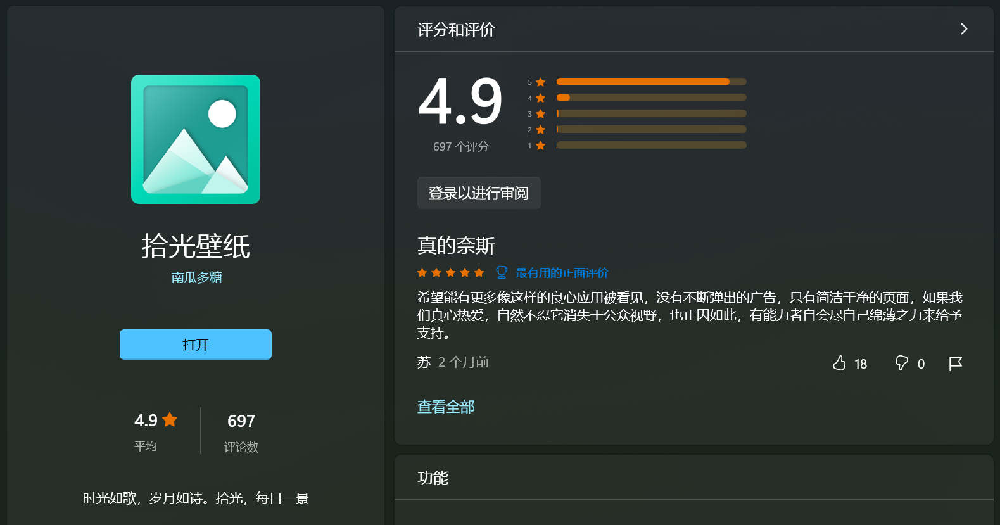
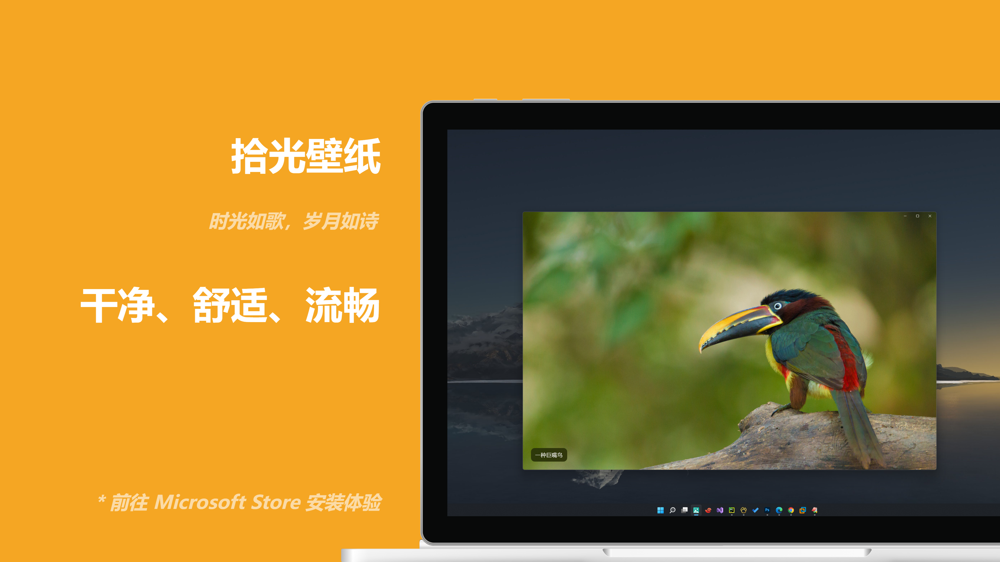
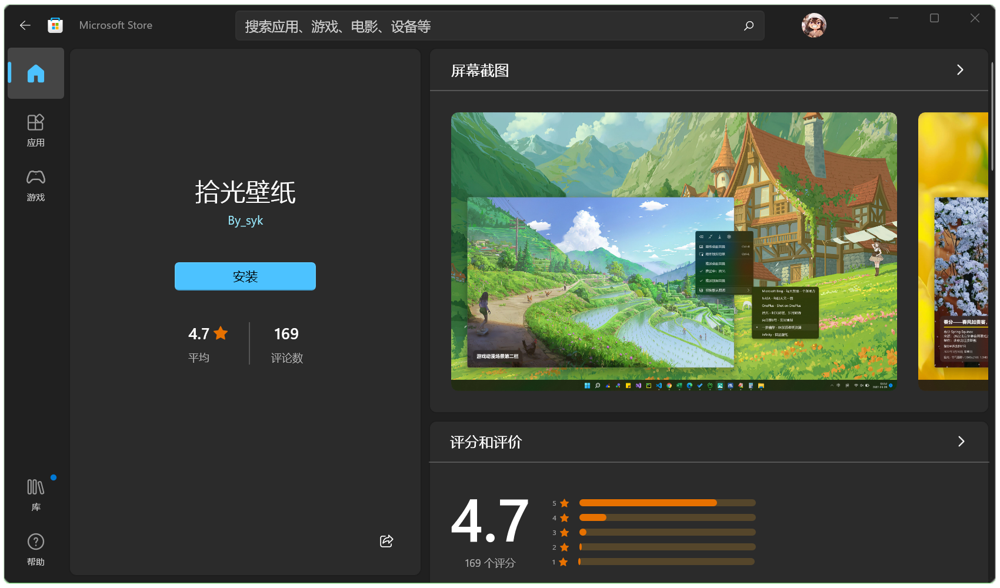

# 拾光

> 时光如歌，岁月如诗。拾光，每日一景

`拾光` 是一款壁纸应用，干净、舒适、流畅。集成多个高质量图源，支持每日推送桌面/锁屏。使用 UWP 框架开发，遵循 Fluent Design，是原生的 Windows 应用，于 Windows 11 体验最佳，向下兼容 Windows 10。

## 开始

提供以下两种安装方式：

+ 从 Microsoft Store 安装  
  在 Microsoft Store 搜索 `拾光壁纸` 进行安装。直达链接：[拾光壁纸 - Microsoft Store](https://www.microsoft.com/store/apps/9N7VHQ989BB7)
+ 下载安装包手动安装    
  在右侧的 [发行版](https://gitee.com/nguaduot/timeline/releases) 页面，找到最新版本，下载压缩包，然后解压，找到 `install.ps1` 脚本，右键 **使用 PowerShell 运行**，根据提示即可顺利安装。  
  如无法顺利安装，请参考：[Wiki / 安装](https://gitee.com/nguaduot/timeline/wikis/%E5%AE%89%E8%A3%85)

体验网页版：[app.nguaduot.cn/timeline](https：//app.nguaduot.cn/timeline)

## 图源

自建图源：
+ [拾光](https://api.nguaduot.cn/timeline/doc) - 时光如歌，岁月如诗 [[网页版]](https://api.nguaduot.cn/timeline/demo) [[DOC]](https://api.nguaduot.cn/timeline/doc)  
  展示图片均已获作者授权
+ 贪食鬼 - 饕餮盛宴 [[网页版]](https://api.nguaduot.cn/glutton/demo)

三方图源：
+ [Microsoft Bing](https://cn.bing.com) - 每天发现一个新地方
+ [NASA](https://apod.nasa.gov/apod) - 每日天文一图 [[网页版]](https://api.nguaduot.cn/nasa/demo)
+ [ONE · 一个](http://m.wufazhuce.com/one) - 复杂世界里，一个就够了
+ [向日葵8号](https://himawari.asia/) - 实时地球
+ [一梦幽黎](https://www.ymyouli.com) - 8K优质壁纸资源 [[网页版]](https://api.nguaduot.cn/ymyouli/demo)
+ [轻壁纸](https://qingbizhi.com/) - 壁纸分享站 [[网页版]](https://api.nguaduot.cn/qingbz/demo)
+ [wallhaven](https://wallhaven.cc/) - The best wallpapers on the Net [[网页版]](https://api.nguaduot.cn/wallhaven/demo)
+ [WallHere](https://wallhere.com) - One of the best hd wallpapers site [[网页版]](https://api.nguaduot.cn/wallhere/demo)
+ [极简壁纸](https://bz.zzzmh.cn/index) - PC高清桌面壁纸 [[网页版]](https://api.nguaduot.cn/zzzmh/demo)
+ [壁纸社](https://www.toopic.cn/dnbz) - 桌面高清壁纸 [[网页版]](https://api.nguaduot.cn/toopic/demo)
+ [彼岸图网](https://pic.netbian.com/) - 4K高清壁纸 [[网页版]](https://api.nguaduot.cn/netbian/demo)
+ [backiee](https://backiee.com/) - Free Ultra HD wallpaper platform [[网页版]](https://api.nguaduot.cn/backiee/demo)
+ [Infinity](http://cn.infinitynewtab.com) - 精选高清壁纸
+ [美图集](https://photo.ihansen.org/) - 看好的壁纸、风景、素材库
+ LSP - 不可描述 [网页版]
+ [OnePlus](https://photos.oneplus.com) - Shot on OnePlus
+ [WallpaperUP](https://www.wallpaperup.com) - Your best source of wallpapers [[网页版]](https://api.nguaduot.cn/wallpaperup/demo)
+ [乌云壁纸](https://www.obzhi.com) - 高清壁纸站 [[网页版]](https://api.nguaduot.cn/obzhi/demo)

本地图源：
+ 本地图库 - 我的精选

## 推送

前往浏览：[Wiki / 推送](https://gitee.com/nguaduot/timeline/wikis/%E6%8E%A8%E9%80%81)

## 快捷键

打开 `拾光`，快捷键 `F1` 可查看。  
或前往浏览：[Wiki / 快捷键](https://gitee.com/nguaduot/timeline/wikis/%E5%BF%AB%E6%8D%B7%E9%94%AE)

## 进阶

**Q：如何使用配置文件？**

A：打开 `拾光`，右键菜单点击 `设置` 图标，设置页下滑找到 `配置文件` 项，展开后点击 `打开` 按钮即可。  
或使用快捷键：`Ctrl` + `I`。详细玩法：[Wiki / 配置文件](https://gitee.com/nguaduot/timeline/wikis/%E9%85%8D%E7%BD%AE%E6%96%87%E4%BB%B6)

**Q：如何调高桌面壁纸推送频率？**

A：一般图源推送周期为 `24h`，即每一天推送一次，可通过如下步骤进行自定义：
+ 打开配置文件
+ 找到目标图源的块 `[xxx]`（如 `一梦幽黎` 块为 `[ymyouli]`），找到参数 `desktopperiod`（推送间隔小时数），调为 `1` - `24` 之间的值，保存即可
+ 右键菜单开启桌面/锁屏推送即可

**Q：如何解锁 `LSP` 图源？**

A：`LSP` 为不可描述内容，默认不可见，若手动开启，则视为您已成年且自行承担责任：
+ 打开配置文件
+ 找到 `[app]` 块，将 `r18` 参数值修改为 `1`，保存，重新打开应用，图源列表中 `LSP` 将可见

## 更新日志

前往浏览：[CHANGELOG.md](./CHANGELOG.md)

## 声明

`拾光` 为非营利性项目，所有图片来自网络，仅供分享交流。  
如有侵权，请联系我进行删除，在此诚挚致歉。

所分享图片，本项目无权且不提供商用授权，故请勿擅自用于商业用途。  
感谢理解与支持。

## 反馈

相关问题或合作意向，可在以下渠道联系我：
+ 邮件 [nguaduot@163.com](mailto:nguaduot@163.com)
+ 酷安 [@南瓜多糖](http://www.coolapk.com/u/474144)
+ 哔哩哔哩 [@南瓜多糖](https://space.bilibili.com/321810619)
+ Telegram [@nguaduot](https://t.me/nguaduot)

## 致谢

上架 Microsoft Store 将近一年，收到全球评分 1000+ 次，其中 92% 给了满分，目前尚在最高评分榜前二十（同类第一），日活用户 2000+，且发现多篇推广文章，非常令人开心。  
`拾光` 为非营利性项目，但也收到一些赞助（捐赠），基本可平衡服务器成本，继续运营一两年问题不大。

诚挚感谢诸君的喜爱与支持，共勉共进。

## 截图

*Copyright © 2021-2022 nguaduot. All rights reserved.*
